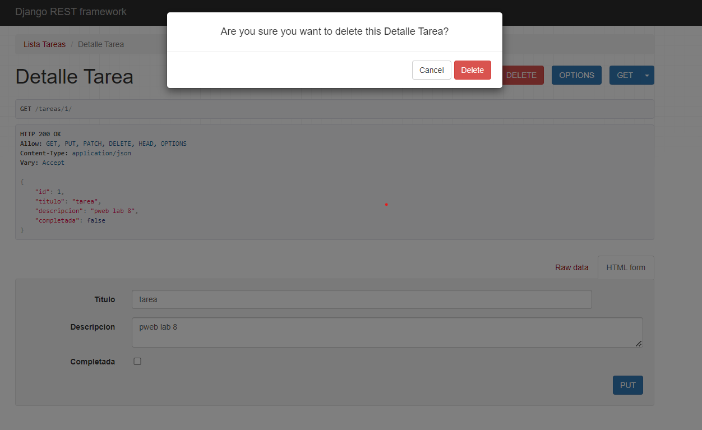

# Laboratorio_08_PWEB2
<table>
    <theader>
        <tr>
            <td></td>
            <th align="center">
                UNIVERSIDAD NACIONAL DE SAN AGUSTIN 
                FACULTAD DE INGENIERÍA DE PRODUCCIÓN Y SERVICIOS 
                ESCUELA PROFESIONAL DE INGENIERÍA DE SISTEMAS
            </th>
            <td></td>
        </tr>
    </theader>
    <tbody>
        <tr><td colspan="3">Formato: Guía de Práctica de Laboratorio / Talleres / Centros de Simulación</td></tr>
        <tr><td>Aprobación:  2023/03/01</td><td>Código: GUIA-PRLD-001</td><td>Página: 1</td></tr>
    </tbody>
</table>

    <h2>INFORME DE LABORATORIO</h2>

<table>
<theader>
    <tr><th colspan="6" style="width:50%; height:auto; text-align:center">INFORMACIÓN BÁSICA</th></tr>
</theader>
<tbody>
    <tr>
        <td>ASIGNATURA:</td><td colspan="5">Laboratorio de Programación Web 2 - Grupo "B"</td>
    </tr>
    <tr>
        <td>TÍTULO DE LA PRÁCTICA:</td><td colspan="5">Laboratorio 8</td>
    </tr>
    <tr>
        <td>NÚMERO DE PRÁCTICA:</td><td>08</td><td>AÑO LECTIVO:</td><td>2023 A</td><td>NRO. SEMESTRE:</td><td>III</td>
    </tr>
    <tr>
        <td colspan="2">FECHA DE PRESENTACIÓN:</td><td>25-Jul-2023</td><td colspan="2">HORA DE PRESENTACIÓN:</td><td>23:59</td>
    </tr>
    <tr>
        <td colspan="3">INTEGRANTES:
        <ol>
        <li>Layme Mamani, Gonzalo Rail</li>
        </ol>
        </td>
        <td colspan="2"> NOTA:</td>
        <td>     </td>
    </tr>
    <tr>
        <td colspan="6">DOCENTE: 
        Mg. ANIBAL SARDON
        </td>
    </tr>
</tdbody>
</table>

<table>
    <theader>
        <tr>
            <th style="text-align:center">SOLUCIÓN Y RESULTADOS</th>
        </tr>
    </theader>
    <tbody>
        <tr>
            <td>
            I. SOLUCIÓN DE EJERCICIOS/PROBLEMAS 
                    Repositorio general 
                    <a href="https://github.com/GonzaloRail/Laboratorio_08_PWEB2">https://github.com/GonzaloRail/Laboratorio_08_PWEB2</a>
            <ul>
                <li>
                    Proyecto: Lista de Tareas
                    Solucion: <a href="https://github.com/GonzaloRail/Laboratorio_08_PWEB2/tree/main/listaDetareas">https://github.com/GonzaloRail/Laboratorio_08_PWEB2/tree/main/listaDetareas</a>
                    Menu
                    
                    Detalle de la Tarea
                    
                    Create
                    
                    Read
                    
                    Update
                    
                    Delete
                     
                    Demostracion de Codigo 
                    Models.py--- Se crea la base de datos, ingresando su parametros
                    
                    Views.py--- Se crea views para la funcionalidad, para ver la lista y ver detalladamente la lista
                    
                    Serializers.py
                    
                    Urls.py--- Vemos las urls y podremos movernos de pagina en pagina
                    

                </li>
                <li>
                    Proyecto: Tutorial
                    Solucion: <a href="https://github.com/GonzaloRail/Laboratorio_08_PWEB2/tree/main/tutorial/tutorial">https://github.com/GonzaloRail/Laboratorio_08_PWEB2/tree/main/tutorial/tutorial</a>
                    Tutorial
                    
                </li>
                <li>
                     Commits:  
                    
                </li>
                </li>
            </ul>
            </td>
        </tr>
        <tr>
            <td>
            </td>
            </td>
        </tr>
    </tbody>
</table>

<table>
    <theader>
        <tr>
        </tr>
    </theader>
    <tbody>
        <tr>
            <td>
            </td>
        </tr>
    </tbody>
</table>

<table>
    <theader>
        <tr>
         <th style="text-align:center">REFERENCIAS Y BIBLIOGRAFÍA</th>
        </tr>
    </theader>
    <tbody>
        <tr>
        <td>
                https://www.django-rest-framework.org/
https://www.django-rest-framework.org/tutorial/quickstart/
https://www.django-rest-framework.org/tutorial/1-serialization/
https://www.django-rest-framework.org/tutorial/3-class-based-views/
https://www.django-rest-framework.org/api-guide/authentication/
https://www.bezkoder.com/django-rest-api/
https://stackoverflow.com/questions/70319606/importerror-cannot-import-name-url-from-django-conf-urls-after-upgrading-to
            </td>
        </tr>
    </tbody>
</table>